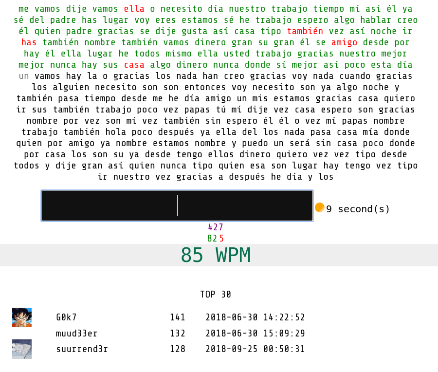

## Typing Test

#### TODO
- [ ] Reimplementarlo en Django.
- [ ] Agregar perfiles de usuarios. 
- [ ] Agregar estadísticas.
- [ ] Agregar más redes sociales.
- [ ] Autodetectar idioma del visitante y rediccionarlo a la página correspondiente.
- [x] Recuperar sólo los mejores puntajes de cada uno. 
- [ ] Contar pulsaciones a través de las palabras correctas e incorrectas,
pero considerar sólo las positivas para calcular WPM.
- [x] Diferentes colores.
- [x] Agregar db.
